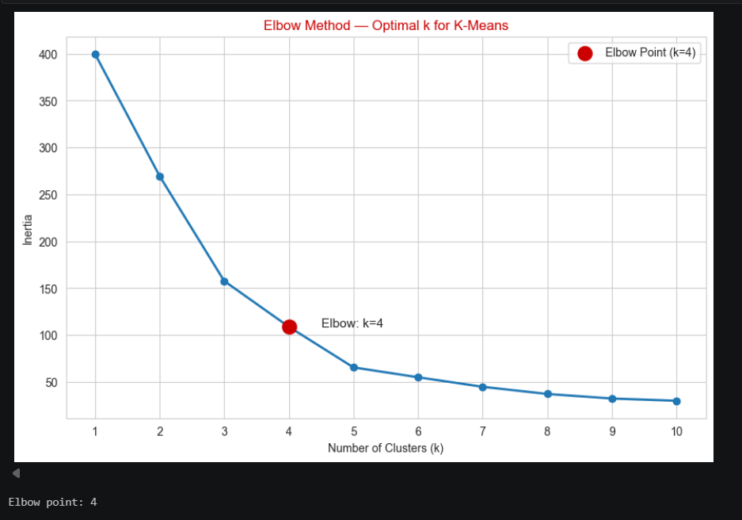
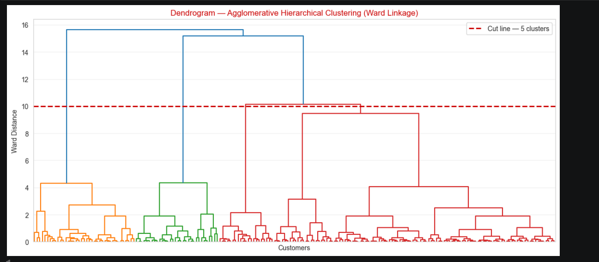
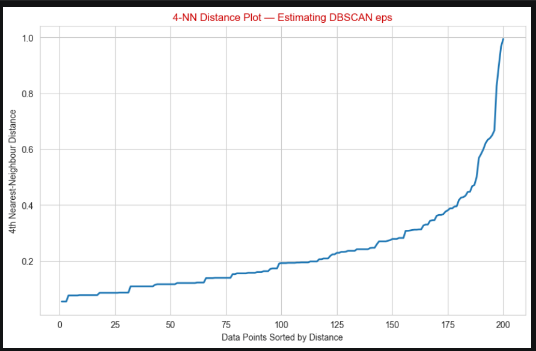
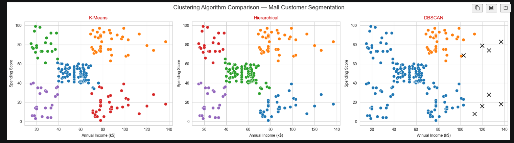

<div align="center">

# 🛍️ Mall Customer Segmentation

### Unsupervised Learning • Customer Analytics • Machine Learning

<p>
  
  
  
  
  
</p>

<p>
  <b>Discovering meaningful customer segments using K-Means, Hierarchical Clustering and DBSCAN.</b>
</p>

</div>

---

## 📌 Project Overview

**Mall Customer Segmentation** is an unsupervised machine learning project designed to identify groups of customers with similar characteristics and spending behaviour.

The project uses customer demographic and spending information to discover hidden patterns without a predefined target label.

### 🎯 Main Objective

The objective is to segment mall customers into meaningful groups using three clustering techniques:

* 🔵 **K-Means Clustering**
* 🌳 **Agglomerative Hierarchical Clustering**
* ⚫ **DBSCAN**

The resulting customer groups can help businesses understand different customer behaviours and support data-driven marketing and customer engagement strategies.

---

# 🧩 Problem Statement

A mall may have hundreds or thousands of customers, but treating every customer in the same way may not be effective.

Customers can differ in:

* Age
* Annual income
* Spending behaviour
* Demographic characteristics

Instead of manually defining customer categories, clustering algorithms can automatically identify customers with similar patterns.

### Business Question

> **Can we identify meaningful customer segments from customer demographic and spending data using unsupervised learning?**

---

# 📊 Dataset

The project uses the **Mall Customer Segmentation Dataset** available on Kaggle.

🔗 **Dataset:**
https://www.kaggle.com/datasets/vjchoudhary7/customer-segmentation-tutorial-in-python

### Dataset Information

| Property         | Details               |
| ---------------- | --------------------- |
| Rows             | 200                   |
| Columns          | 5                     |
| Missing Values   | 0                     |
| Duplicate Rows   | 0                     |
| Problem Type     | Unsupervised Learning |
| Primary Analysis | Customer Segmentation |

### Original Features

| Feature                  | Description                |
| ------------------------ | -------------------------- |
| `CustomerID`             | Unique customer identifier |
| `Gender`                 | Customer gender            |
| `Age`                    | Customer age               |
| `Annual Income (k$)`     | Annual income              |
| `Spending Score (1-100)` | Spending behaviour score   |

---

# 🔄 Project Workflow

```text
                 ┌──────────────────────┐
                 │     Load Dataset     │
                 └──────────┬───────────┘
                            ↓
                 ┌──────────────────────┐
                 │ Data Understanding   │
                 └──────────┬───────────┘
                            ↓
                 ┌──────────────────────┐
                 │ Data Preprocessing   │
                 └──────────┬───────────┘
                            ↓
                 ┌──────────────────────┐
                 │        EDA           │
                 └──────────┬───────────┘
                            ↓
          ┌─────────────────┼─────────────────┐
          ↓                 ↓                 ↓
     K-Means           Hierarchical        DBSCAN
          │                 │                 │
          └─────────────────┼─────────────────┘
                            ↓
                 ┌──────────────────────┐
                 │ Model Comparison     │
                 └──────────┬───────────┘
                            ↓
                 ┌──────────────────────┐
                 │ Business Insights    │
                 └──────────────────────┘
```

---

# 🧹 1. Data Preprocessing

The dataset was first inspected using:

* `head()`
* `info()`
* `describe()`
* null-value checks
* duplicate checks

### Column Cleaning

The following columns were renamed:

```text
Annual Income (k$)       → Annual_Income
Spending Score (1-100)   → Spending_Score
```

`CustomerID` was removed because it is an identifier and does not represent customer behaviour.

### Gender Encoding

The categorical `Gender` feature was converted into numerical form using **Label Encoding**.

---

# 🔎 2. Exploratory Data Analysis

EDA was performed to understand the distribution and relationships between customer features.

### Visualizations Used

* 📊 Histograms with KDE
* 🔗 Pairplot
* 🌡️ Correlation Heatmap

### Distribution Analysis

The distributions of the following features were analysed:

* Age
* Annual Income
* Spending Score

### Primary Segmentation Features

The main segmentation analysis focuses on:

> **Annual Income vs Spending Score**

These two variables are particularly useful for customer segmentation because they directly represent a customer's financial capacity and spending behaviour.

---

## 📸 EDA Visual Analysis

> The following visualizations are generated directly from the project notebook.

<div align="center">

### Customer Feature Relationships


</div>

<div align="center">

### Correlation Analysis


</div>

> **Note:** If these two files are not present in your `screenshots` folder, remove these two image lines or upload the corresponding notebook screenshots using the exact filenames.

---

# ⚙️ 3. Feature Scaling

Before applying distance-based clustering algorithms, the numerical features were standardized using:

```python
StandardScaler()
```

The following features were scaled:

```text
Age
Annual_Income
Spending_Score
```

`Gender` was not included in the primary 2-feature clustering visualization.

### Why Scaling?

Distance-based algorithms can be affected when features have different numerical ranges.

For example:

```text
Annual Income      → larger numerical range
Spending Score     → smaller numerical range
```

Standardization puts numerical features on a comparable scale.

---

# 🔵 4. K-Means Clustering

K-Means clustering partitions customers into groups based on similarity.

### Steps

```text
Choose K
   ↓
Initialize Centroids
   ↓
Assign Customers
   ↓
Update Centroids
   ↓
Repeat
   ↓
Final Customer Segments
```

---

## 📉 Elbow Method

The Elbow Method was used to determine a suitable number of clusters.

The model was tested for:

```text
K = 1 to 10
```

### Result

The observed elbow point was:

> **K = 4**

<div align="center">



</div>

---

## 📈 Silhouette Analysis

Silhouette Score was evaluated for:

```text
K = 2 to 10
```

The best observed value was:

| Parameter        |       Result |
| ---------------- | -----------: |
| Best K           |        **5** |
| Silhouette Score | **0.554657** |

Therefore, the final K-Means model was built using:

```python
KMeans(
    n_clusters=5,
    random_state=42,
    n_init=10
)
```

---

## 🎯 K-Means Customer Segments

The generated cluster labels were stored in:

```python
df["KMeans_Cluster"]
```

The clusters were visualized using:

* Annual Income
* Spending Score
* Cluster labels
* Cluster centroids

---

# 🌳 5. Agglomerative Hierarchical Clustering

Hierarchical clustering builds a hierarchy of observations by progressively merging similar groups.

### Method Used

```text
Agglomerative Clustering
        +
Ward Linkage
        +
5 Clusters
```

---

## 🌳 Dendrogram

A dendrogram was created to visualize the hierarchical merging process.

<div align="center">



</div>

### Final Model

```python
AgglomerativeClustering(
    n_clusters=5,
    linkage="ward"
)
```

The generated cluster labels were stored in:

```python
df["Hier_Cluster"]
```

---

# ⚫ 6. DBSCAN Clustering

DBSCAN is a density-based clustering algorithm.

Unlike K-Means, DBSCAN does not require the number of clusters to be specified beforehand.

### Important Parameters

```text
eps
min_samples
```

DBSCAN can also identify unusual observations as:

```text
Noise = -1
```

---

## 📍 4-NN K-Distance Analysis

A k-distance plot was used to investigate a suitable `eps` value.

<div align="center">



</div>

### DBSCAN Parameter Search

The project evaluated combinations of:

```text
eps:
0.2
0.3
0.4
0.5
0.6

min_samples:
3
4
5
6
```

The search considered:

* Number of clusters
* Number of noise points
* Silhouette Score excluding noise

---

# 📊 7. Algorithm Comparison

The three clustering approaches were compared visually.

<div align="center">



</div>

### Algorithms Compared

| Algorithm    | Type            | Main Idea                         |
| ------------ | --------------- | --------------------------------- |
| K-Means      | Centroid-based  | Groups customers around centroids |
| Hierarchical | Hierarchy-based | Builds nested customer groups     |
| DBSCAN       | Density-based   | Finds dense regions and noise     |

---

# 📏 8. Evaluation Metrics

Three clustering evaluation metrics were used:

### Silhouette Score

Measures how similar an observation is to its own cluster compared with other clusters.

```text
Higher → better-defined separation
```

### Davies-Bouldin Index

Measures similarity between clusters.

```text
Lower → better
```

### Calinski-Harabasz Index

Measures between-cluster separation relative to within-cluster dispersion.

```text
Higher → better
```

> The final numerical comparison should be taken directly from the notebook output so that the README reflects the actual executed model results.

---

# 👥 9. Customer Segment Profiling

After clustering, customer groups were profiled using average values of:

* Age
* Annual Income
* Spending Score

This transforms mathematical clusters into interpretable customer segments.

### Example Business Interpretation

| Customer Pattern                    | Possible Interpretation                        |
| ----------------------------------- | ---------------------------------------------- |
| High Income + High Spending         | High-value customers                           |
| High Income + Low Spending          | Potential conversion opportunity               |
| Low Income + High Spending          | Strong spending behaviour despite lower income |
| Low Income + Low Spending           | Lower engagement segment                       |
| Moderate Income + Moderate Spending | General customer segment                       |

> Cluster labels should be interpreted using the actual profile table generated by the notebook rather than assuming that a specific cluster number always represents a particular customer type.

---

# 💼 10. Business Insights

Customer segmentation can help a mall or retail business move from a one-size-fits-all strategy toward more targeted customer engagement.

### Potential Applications

**🎯 Targeted Marketing**

Different customer groups can receive different campaigns.

**💎 High-Value Customer Identification**

Customers showing both high income and high spending behaviour can be analysed as a distinct business segment.

**📢 Personalized Promotions**

Low-spending customers can be targeted with appropriate offers and engagement campaigns.

**🛍️ Customer Behaviour Analysis**

Income and spending patterns can help identify customer behaviour groups.

**📊 Data-Driven Decision Making**

Clustering provides a structured way to explore hidden patterns within customer data.

---

# 🖼️ Visual Results Gallery

<div align="center">

### Elbow Method


<br><br>

### Hierarchical Dendrogram


<br><br>

### DBSCAN K-Distance


<br><br>

### Algorithm Comparison


</div>

---

# 🧠 Key Machine Learning Concepts Demonstrated

This project demonstrates practical understanding of:

* Unsupervised Learning
* Clustering
* Feature Scaling
* Distance-based Algorithms
* Centroid-based Clustering
* Hierarchical Clustering
* Density-based Clustering
* Elbow Method
* Silhouette Analysis
* Dendrograms
* K-Distance Analysis
* Cluster Profiling
* Model Comparison
* Business Interpretation

---

# 🗂️ Project Structure

```text
Mall-Customer-Segmentation/
│
├── 📓 Mall_Customer_Segmentation.ipynb
│
├── 📊 Mall_Customers.csv
│
├── 📁 screenshots/
│   ├── elbow_method.png
│   ├── dendrogram.png
│   ├── dbscan_k_distance.png
│   ├── algorithm_comparison.png
│   ├── pairplot.png
│   └── correlation_heatmap.png
│
├── 📄 requirements.txt
│
└── 📖 README.md
```

> Update the notebook and CSV filenames above if your repository uses different exact filenames.

---

# 🛠️ Tech Stack

<div align="center">

| Technology          | Purpose                              |
| ------------------- | ------------------------------------ |
| 🐍 Python           | Programming                          |
| 🐼 Pandas           | Data manipulation                    |
| 🔢 NumPy            | Numerical computation                |
| 📊 Matplotlib       | Visualization                        |
| 🎨 Seaborn          | Statistical visualization            |
| 🤖 Scikit-learn     | Machine Learning                     |
| 🌳 SciPy            | Hierarchical clustering / dendrogram |
| 📓 Jupyter Notebook | Development environment              |

</div>

---

# ⚙️ Installation & Setup

### 1️⃣ Clone the Repository

```bash
git clone https://github.com/dhorajiyamisri/Mall-Customer-Segmentation.git
```

### 2️⃣ Move into the Project

```bash
cd Mall-Customer-Segmentation
```

### 3️⃣ Install Dependencies

```bash
pip install -r requirements.txt
```

### 4️⃣ Launch Jupyter Notebook

```bash
jupyter notebook
```

### 5️⃣ Open the Project Notebook

Run the notebook cells sequentially to reproduce:

```text
EDA
↓
Preprocessing
↓
K-Means
↓
Hierarchical Clustering
↓
DBSCAN
↓
Evaluation
↓
Business Insights
```

---

# 📦 Requirements

The project uses the following Python libraries:

```text
pandas
numpy
matplotlib
seaborn
scikit-learn
scipy
```

---

# 🚀 Future Improvements

Possible future extensions include:

* Interactive customer segmentation dashboard
* Automated cluster naming
* 3D customer segmentation visualization
* Customer recommendation system
* Interactive Streamlit application
* Larger real-world customer datasets
* Advanced cluster validation
* Automated business reporting

---

# 🎓 Learning Outcome

Through this project, I gained practical experience in applying unsupervised learning techniques to a real-world customer analytics problem.

The project helped strengthen my understanding of:

> **Data Preparation → EDA → Feature Scaling → Clustering → Evaluation → Interpretation → Business Insights**

---

# 🔗 Project Links

### 💻 GitHub Repository

https://github.com/dhorajiyamisri/Mall-Customer-Segmentation

### 📊 Dataset

https://www.kaggle.com/datasets/vjchoudhary7/customer-segmentation-tutorial-in-python

---

<div align="center">

# 👩‍💻 Author

### **Misari Dhorajiya**

**AI & ML with Data Science**

📊 Data Science • Machine Learning • Data Analytics

<br>

<a href="https://github.com/dhorajiyamisri">
  
</a>

</div>

---

<div align="center">

### ⭐ If you found this project useful, consider giving the repository a star!

**Built with Python • Scikit-learn • Data Science**

</div>
